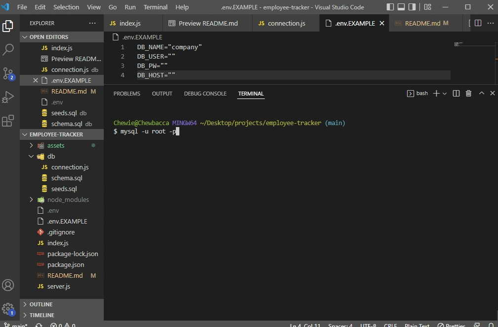
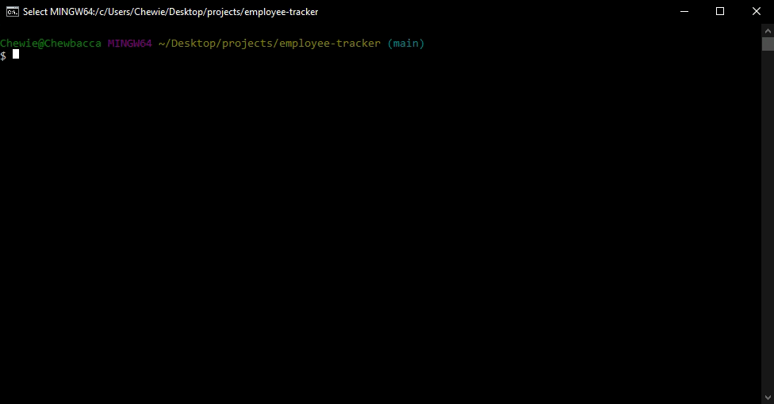

# Employee Tracker

## Table of Contents

* [Description](#description)
* [Installation](#installation)
* [Usage](#usage)
* [Contributions](#contributions)
* [Additional Information](#additional-information)

## [Description:](#table-of-contents)
The Employee Tracker is a command-line application that focuses on being a team management tool that allows a user to view and manipulate their team's information. A user can navigate through departments, roles, and employee information stored within a database system using nothing but command-line prompts.

*User Story*
```
AS A business owner
I WANT to be able to view and manage the departments, roles, and employees in my company
SO THAT I can organize and plan my business
```

## [Installation:](#table-of-contents)
1. To install the required dependencies, run the following command:
```
npm install
```
2. Make a copy of the `.env.EXAMPLE` file, change it to just `.env` and fill out the required fields with your MySQL info.
3. Database, table creation and seed data has been provided within the `db` folder. Connect to MySQL in the command-line and run `source db/schema.sql` and `source db/seeds.sql` to manually seed the data from the provided scripts.

 


## [Usage:](#table-of-contents)
[Employee Tracker: Walkthrough Video](https://drive.google.com/file/d/1pMD4pYd1leWnF2j4OzvBGH5t9uydJcAN/view?usp=sharing)

This app runs from the command line. After cloning the repo and installing dependencies, invoke application with:
```
npm start
```


## [Contributions:](#table-of-contents)
Contributors and feedback always welcome!

## [Additional Information:](#table-of-contents)
Project Technologies:
* Node.js
* MySQL
* [Inquirer](https://www.npmjs.com/package/inquirer)
* [dotenv](https://www.npmjs.com/package/dotenv)


_If you have any questions about the application, or would like to become a contributor, please contact me using the information below:_

[GitHub](https://github.com/blindsweatyhansolo)